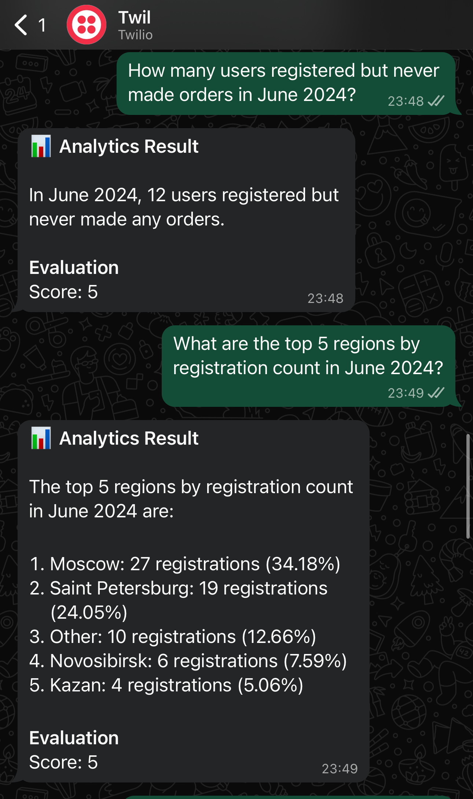

# Vivid Analytics Bot

An intelligent analytics bot that processes natural language queries about user data and provides automated evaluations. Supports both Telegram and WhatsApp integrations with AI-powered analytics tools.

## 🔄 How It Works

### 1. **User Message Processing**
When a user sends a message:
- Bot receives the query (e.g., "Show me registration dynamics for June 2024")
- Query is forwarded to the LangGraph AI agent for processing

### 2. **Tool Selection & Execution**
The AI agent:
- Analyzes the user query to understand the intent
- Automatically selects the appropriate analytics tool from 10 available functions:
  - `calculate_active_users_by_region`
  - `calculate_registration_dynamic`
  - `calculate_conversion_rate`
  - `calculate_customer_lifetime_value`
  - And 6 other specialized analytics tools
- Executes the selected tool with extracted parameters (dates, regions, etc.)
- Loads CSV data and performs calculations using pandas

### 3. **Response Generation & Evaluation**
- AI agent formats the results into a human-readable response
- **Automatic Evaluation System** compares the response against ground truth data:
  - Parses the AI response to extract key metrics
  - Compares against pre-computed expected values 
  - Assigns accuracy score (0-5) based on how close the results match
  - For queries outside ground truth coverage, uses model-vs-model comparison
- Final response includes both the analytics result and evaluation score

## 📱 Demo





## Demo for Model-to-Model eval (when requested dates are not equal to 2024-06-01-2025-06-30)


## 🛠 Installation

### Prerequisites
- Python 3.8+
- Telegram Bot Token (from @BotFather)
- Twilio Account (for WhatsApp)
- OpenAI API Key

### Setup Steps

1. **Clone and install**
   ```bash
   git clone <your-repo-url>
   cd vivid_test
   pip install -r requirements.txt
   ```

2. **Configure environment variables**
   Create a `.env` file:
   ```env
   # Telegram Bot (optional)
   BOT_TOKEN=your_telegram_bot_token
   
   # OpenAI
   OPENAI_API_KEY=your_openai_api_key
   
   # Twilio WhatsApp (optional)
   TWILIO_ACCOUNT_SID=your_twilio_account_sid
   TWILIO_AUTH_TOKEN=your_twilio_auth_token
   TWILIO_WHATSAPP_NUMBER=whatsapp:+14155238886
   ```

3. **Generate sample data** (optional)
   ```bash
   python -m vivid_analytics.data.make_dummies
   ```

4. **Data Files Location**
   The bot uses CSV files located in:
   ```
   data/raw/users.csv    # User registration data
   data/raw/orders.csv   # Order transaction data
   ```
   These files are automatically generated by step 3, or you can provide your own data files in the same format.

## 🚀 Running the Bots

### Telegram Bot
```bash
python -m vivid_analytics.bots.telegram_bot
```

### WhatsApp Bot (Twilio)
```bash
python -m vivid_analytics.bots.twilio_whatsapp_bot
```

For WhatsApp, you'll also need to expose the webhook using ngrok:
```bash
ngrok http 5000
```
Then configure the ngrok URL in your Twilio Console.
